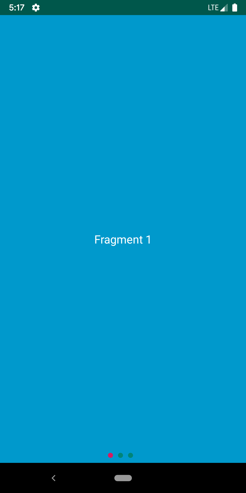
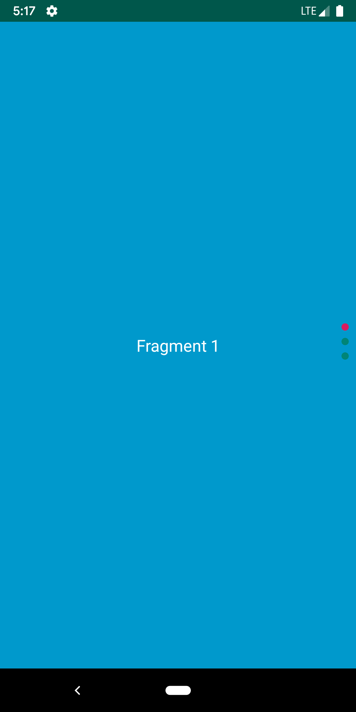

# ViewPager2Indicator

**ViewPager2Indicator** is an Android library for displaying page indicators when using [ViewPager2](https://developer.android.com/jetpack/androidx/releases/viewpager2). 

Features:
- Customize the color of the selected and unselected page indicators
- Customize the radius of the page indicators
- Customize the spacing between page indicators
- Works with horizontal and vertical ViewPagers

| Horizontal indicator  | Vertical indicator |
| ------------- | ------------- |
|  |  |

Usage
---------
1. Add the JitPack repository to your project-level build file and the dependency to the app-level build file.
```groovy
// build.gradle (project-level)
allprojects {
 repositories {
  // ...
  maven { url 'https://jitpack.io' }
 }
}

// build.gradle (app-level)
implementation 'com.github.thellmund:ViewPager2Indicator:0.8.1’
```

2. Add a `ViewPager2Indicator` in your XML layout.
```xml
<LinearLayout ... >

    <androidx.viewpager2.widget.ViewPager2
        android:id="@+id/viewPager"
        ... />

    <com.hellmund.viewpager2indicator.ViewPager2Indicator
        android:id="@+id/indicator"
        android:layout_width="wrap_content"
        android:layout_height="wrap_content"
        ...
        app:radius="4dp"
        app:selectedFillColor="@color/white"
        app:spacing="8dp"
        app:unselectedFillColor="@color/gray" />

</LinearLayout>
```

3. Attach `ViewPager2Indicator` to the `ViewPager`.
```kotlin
override fun onCreate(savedInstanceState: Bundle?) {
    // Set up your ViewPager ...
    indicator.attachTo(viewPager)
}
```
